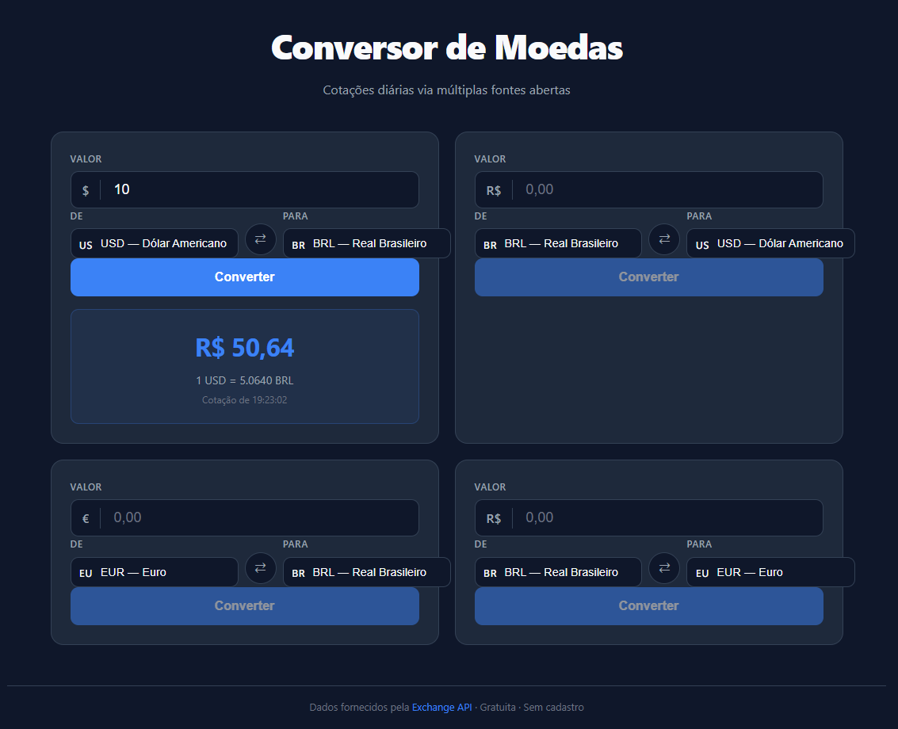

# Conversor de Moedas

Aplicação web para conversão de moedas em tempo real, com cotações fornecidas pela [fawazahmed0 Exchange API](https://github.com/fawazahmed0/exchange-api) — gratuita, sem cadastro, hospedada no jsDelivr CDN.

<p align="center">
  
</p>

## Tecnologias

- **[React 18](https://react.dev/)** com hooks e Strict Mode
- **[TypeScript](https://www.typescriptlang.org/)** em modo strict
- **[Vite 8](https://vite.dev/)** como bundler
- **[fawazahmed0 Exchange API](https://github.com/fawazahmed0/exchange-api)** — gratuita, sem API key, sem cadastro
- **CSS Modules** com design tokens e suporte a dark mode
- **ESLint 9** (flat config) + **Prettier**
- **[Vitest 4](https://vitest.dev/)** + **[Testing Library](https://testing-library.com/)** para testes unitários

## Funcionalidades

- Conversão entre 8 moedas: BRL, USD, EUR, GBP, JPY, CAD, AUD, CHF
- Seleção dinâmica de par de moedas via dropdown
- Botão para inverter par (⇄) com animação
- Exibição da taxa unitária e horário da cotação
- Estado visual de loading, sucesso e erro
- Layout responsivo com grid adaptável
- Dark mode automático via `prefers-color-scheme`
- Cancelamento de requisições em voo com `AbortController`
- Formatação de valores com `Intl.NumberFormat`

## Estrutura do projeto

```
src/
├── components/
│   └── Conversor/
│       ├── Conversor.tsx             # Componente principal
│       ├── Conversor.module.css
│       └── Conversor.test.tsx        # Testes do componente (20 casos)
├── hooks/
│   ├── useCurrencyConverter.ts       # Lógica de fetch + estados
│   └── useCurrencyConverter.test.ts  # Testes do hook (12 casos)
├── types/
│   ├── currency.ts                   # Tipos e lista de moedas
│   └── currency.test.ts              # Testes dos dados (8 casos)
├── test/
│   └── setup.ts                      # Setup global do Vitest
├── App.tsx
├── App.test.tsx                       # Testes da aplicação (6 casos)
├── App.module.css
├── main.tsx
└── index.css                          # Design tokens + reset
```

## Pré-requisitos

- Node.js 18+
- npm 9+

## Instalação e uso

```bash
# Clonar o repositório
git clone https://github.com/danhpaiva/conversor-moeda-React.git
cd conversor-moeda-React

# Instalar dependências
npm install

# Iniciar servidor de desenvolvimento
npm run dev
```

A aplicação estará disponível em `http://localhost:5173`.

## Scripts disponíveis

| Comando | Descrição |
|---|---|
| `npm run dev` | Inicia o servidor de desenvolvimento (HMR) |
| `npm run build` | Gera o build de produção em `dist/` |
| `npm run preview` | Serve o build de produção localmente |
| `npm run lint` | Executa o ESLint |
| `npm run format` | Formata o código com Prettier |
| `npm test` | Executa os testes em modo watch |
| `npm run test:run` | Executa os testes uma única vez |
| `npm run coverage` | Gera relatório de cobertura em `coverage/` |

## Testes

O projeto conta com **46 casos de teste** distribuídos em 4 arquivos, cobrindo tipos, hook, componente e aplicação.

| Arquivo | Casos | O que cobre |
|---|---|---|
| `currency.test.ts` | 8 | Integridade da lista de moedas, metadados, unicidade de códigos |
| `useCurrencyConverter.test.ts` | 12 | Estado inicial, conversão, fallback CDN→CF, loading, erro, reset |
| `Conversor.test.tsx` | 20 | Render, swap, spinner, resultado, erro, validação de input |
| `App.test.tsx` | 6 | Título, 4 cards, pares de moeda, link da API |

```bash
npm run test:run   # roda todos os testes
npm run coverage   # gera relatório de cobertura
```

## API

As cotações são obtidas pela [fawazahmed0 Exchange API](https://github.com/fawazahmed0/exchange-api), completamente gratuita e sem necessidade de chave ou cadastro. Hospedada no jsDelivr CDN com fallback automático para Cloudflare Pages.

Exemplo de requisição (USD → BRL):

```
GET https://cdn.jsdelivr.net/npm/@fawazahmed0/currency-api@latest/v1/currencies/usd.json
```

Fallback automático:
```
GET https://latest.currency-api.pages.dev/v1/currencies/usd.json
```

## Licença

MIT
